.. _assets:

Visualize assets
================

ChainerUI provides ``/assets`` endpoint from v0.8.0 to visualize media assets such image or audio. Basically by using :ref:`module_summary` module, functions convert ``ndarray`` to the specified media type, and show them on a web browser. Assets page can be seen from ``assets`` button on :ref:`result table <ui_training_job_table>` or :ref:`result detail <ui_result_page>`.

TODO: flow page, result row to assets page

.. note::

   ``chainerui.summary`` module requires output directory path. The path **must be same as the directory put** ``log`` **file** to gather media assets as experimental result. The ``log`` file is created by `LogReport <https://docs.chainer.org/en/stable/reference/generated/chainer.training.extensions.LogReport.html>`__ extension or :ref:`chainerui's LogReport <module_log_report>`.

   .. code-block:: python

     from chainer import training
     from chainerui import summary

     out_put = '/path/to/result/'
     trainer = training.Trainer(updater, out=out_put)
     trainer.extend(training.extensions.LogReport())  # log file will be created at `out_put`
     summary.set_out(out_put)  # set output directory as global

From next section, example codes are skipped getting assets and set output directory, like blow snippet.

.. code-block:: python

  # get color images and grayscale images for example
  import chainer
  images, _ = chainer.datasets.get_svhn(withlabel=False)
  images_gs, _ = chainer.datasets.get_mnist(withlabel=False, ndim=2)

  # make dummy audio data for example
  import numpy
  audio = numpy.random.uniform(-1, 1, 16000)

  from chainerui import summary
  summary.set_out('/path/to/result')

Use summary function
--------------------

There are 2 ways to show assets on a web browser. First, use ``summary`` module function directly. The below example is a simple code to show images.

.. code-block:: python

  summary.image(images[0:5])
  summary.image(images[5:10)
  summary.audio(audio, 16000)

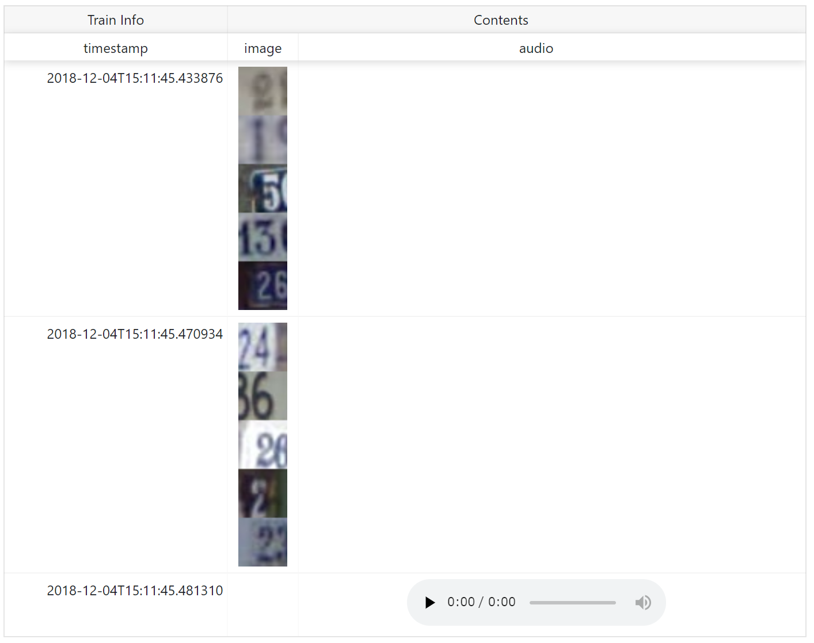

``name`` is shown as column name. When show assets with additional text information such as epoch number, iteration number, descriptions and so on, add them as ``**kwargs``.

.. code-block:: python

  summary.image(images[0:5], name='asset', epoch=1, key='value')
  summary.image(images[5:10], name='asset', epoch=2, key='value2')
  summary.audio(audio, 16000, name='asset', epoch=3, key='value3')

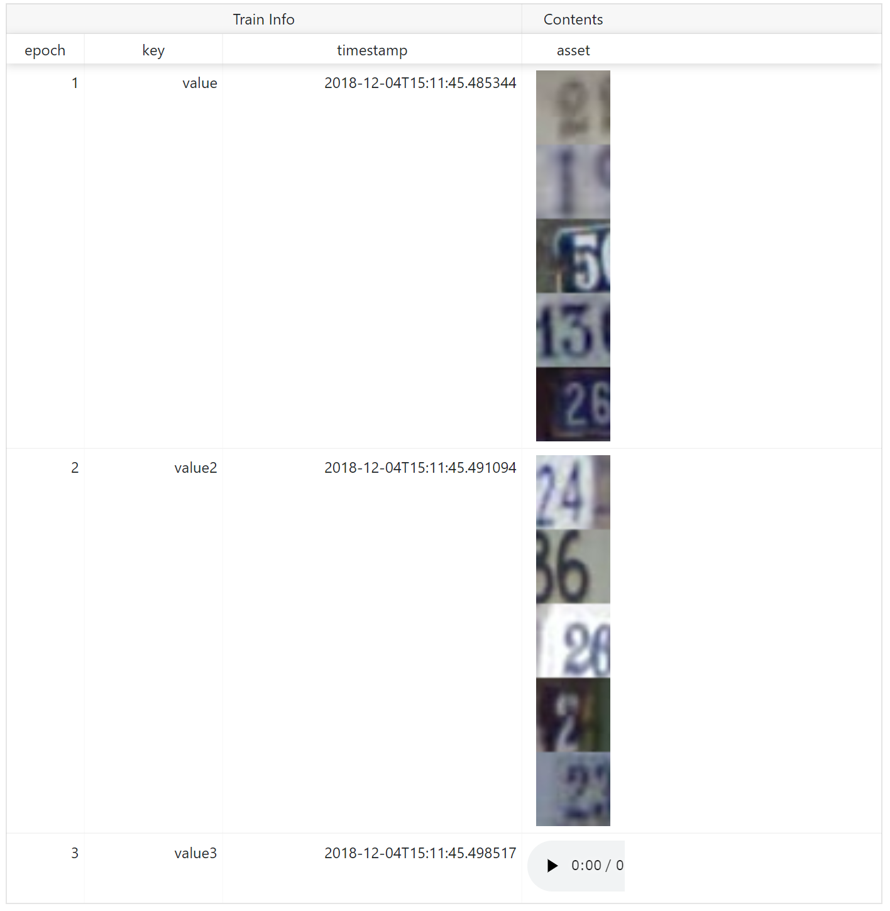

Use ``reporter`` function
-------------------------

Second, to aggregate assets to show them in a same row, use :ref:`reporter <module_summary_reporter>` function. Assets called under ``with`` statement are aggregated.

.. code-block:: python

   with summary.reporter() as r:
       r.image(images[0:5])
       r.image(images[5:10])
   with summary.reporter() as r:
       r.image(images[10:15])
       r.image(images[15:20])
   with summary.reporter() as r:
       r.image(images[20:25])
       r.image(images[25:30])

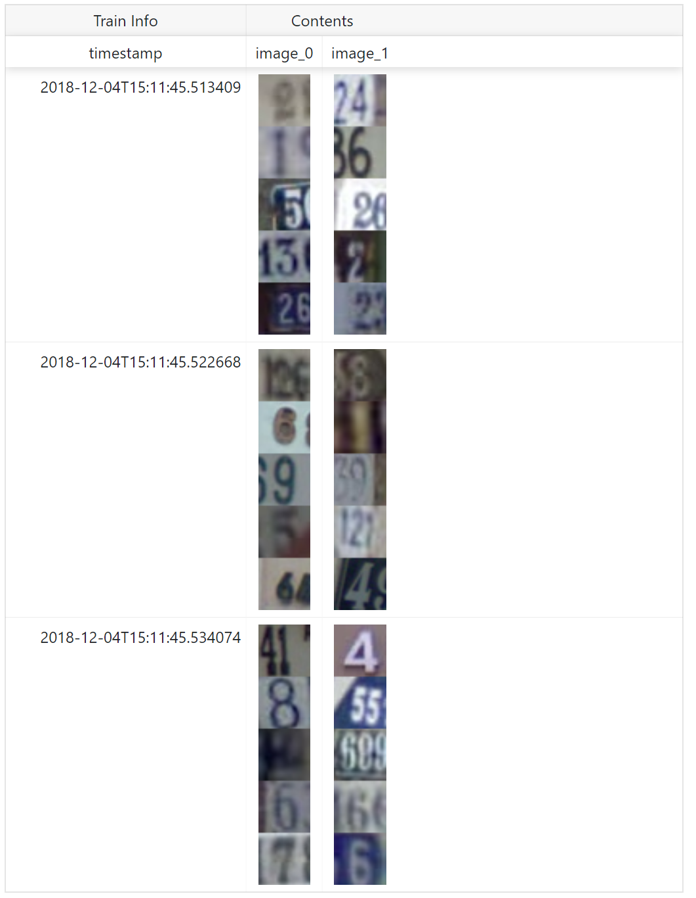

``name`` is shown as column name. ``reporter`` also supports ``**kwargs`` to add other text information.

.. code-block:: python

   with summary.reporter(epoch=1, key='value') as r:
       r.image(images[0:5], name='train1')
       r.image(images[5:10], name='train2')
   with summary.reporter() as r:
       r.image(images[10:15], name='train1')
       r.image(images[15:20], name='train2')
   with summary.reporter() as r:
       r.image(images[20:25], name='train1')
       r.image(images[25:30], name='train2')

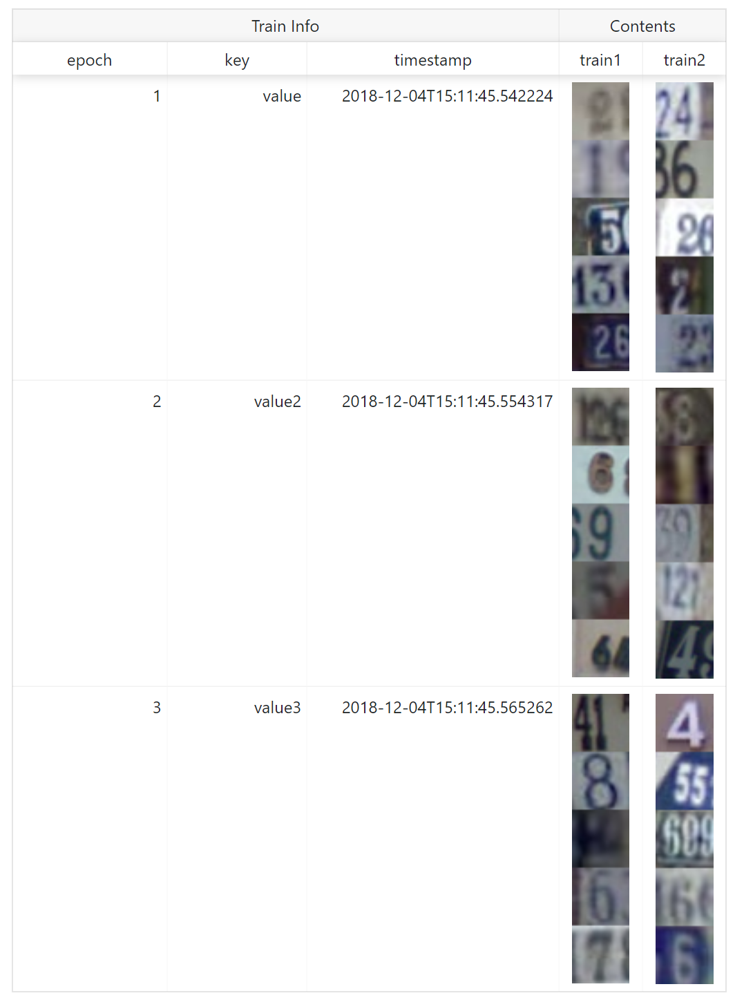

Image
-----

**Required Pillow** to use this function.

Convert ``ndarray`` to image as PNG format, save, and report to ChainerUI server. ``image`` function has some options to customize showing.

* Channel position: Dimensions of ``ndarray`` is considered as batch, channel, height, width on default. If channel is not in 2nd (= ``[1]`` in 0-origin) dimension, set ``ch_axis`` option. For example ``ndarray`` are batch, height, width, channel order, set ``ch_axis=-1``.
* Batched or not: Images are considered as bathed array on default. If an array is not batched, set ``batched=False``.
* Tiled: Batched array is showed in one line on default. If show tiled them, set ``row`` option. For example, batch size is 20 and set ``row=4``, images are tiled 4x5 on web browser.
* Color space: If images are not ``RGB`` or ``RGBA`` color model, set the color mode with ``mode`` option. ChainerUI support ``HSV`` color model, set ``mode='HSV'``.

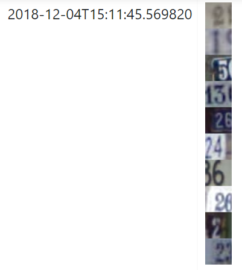

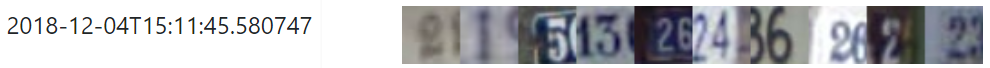

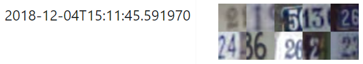

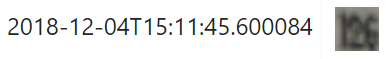

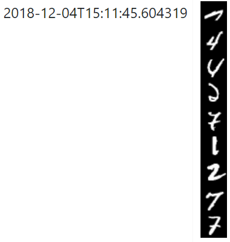

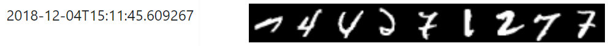

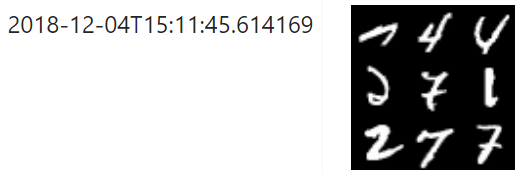

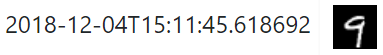

* ``image(images[0:10])``: |image_default|
* ``image(images[0:10], row=1)``: |image_row1|
* ``image(images[0:10], row=2)``: |image_tile|
* ``image(images[10], ch_axis=0, batched=False)``: |image_non_batch|
* ``image(images_gs[0:9])``: |image_grayscale_default|
* ``image(images_gs[0:9], row=1)``: |image_grayscale_row1|
* ``image(images_gs[0:9], row=3)``: |image_grayscale_tile|
* ``image(images_gs[9], batched=False)``: |image_grayscale_non_batch|

Audio
-----

**Required Scipy** to use this function.

Convert ``ndarray`` to audio as WAV format, save and report to ChainerUI server. ``audio`` function requires sample rate.
