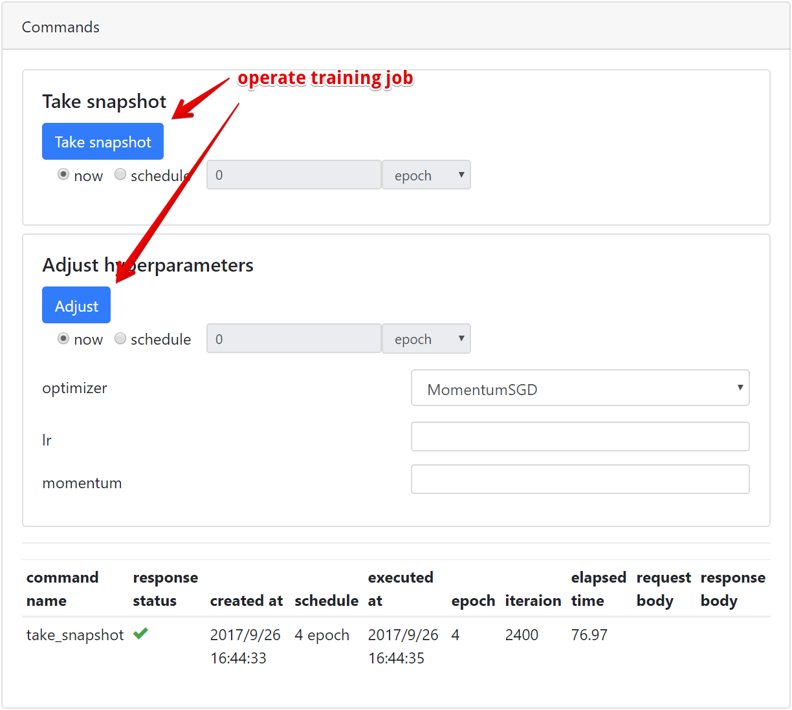

.. _getstart:

Getting started
===============

Create database
---------------

Please setup database at first::

  $ chainerui db create
  $ chainerui db upgrade

Drop database
~~~~~~~~~~~~~

::

  $ chainerui db drop

All cached results will be removed.

Create a project
----------------

::

  $ chainerui project create -d PROJECT_DIR [-n PROJECT_NAME]

The ChainerUI server watches the below files under the project directory recursively.

* ``log``: Used for chart.
* ``args``: (optional) Used for :ref:`result table <ui_training_job_table>`, show as experimental conditions.
* ``commands``: (optional) Created by :ref:`CommandsExtension <module_command_extension>` internally, used for operating training job.

More detail of the files and how to setup training loop, see :ref:`getstart_customize_training_loop`

For example, file and directory structure is the below. When create a project with ``-d path/to/result``, the results of the two directories, ``result1`` and ``result2`` are registered under the ``PROJECT_DIR`` (or ``PROJECT_NAME``) automatically, then ChainerUI gathers the two logs continuously::

  path/to/result/result1
    |--- log       # show values on chart
    |--- args      # show parameters on result table as experimental conditions
    |--- commands  # created by CommandsExtension to operate the training loop
    |--- ...
  path/to/result/result2
    |--- log
    |--- args
    |--- commands
    |--- ...

Start ChainerUI server
----------------------

::

  $ chainerui server

Open http://localhost:5000/ . To stop, press ``Ctrl+C`` on the console. When use original host or port, see :ref:`command option <cmd_server>`:

.. _getstart_customize_training_loop:

Customize training loop
-----------------------

ChainerUI basically supports `Trainer module <https://docs.chainer.org/en/stable/tutorial/trainer.html>`__ included in Chainer, and some functions support without Trainer.

.. note::

   `examples/train_mnist.py <https://github.com/chainer/chainerui/blob/master/examples/train_mnist.py>`__, based on `chainer/examples/mnist/train_mnist.py <https://github.com/chainer/chainer/blob/4de98cf90e747940f1dd7f7f4cdf1fcc0b4b4786/examples/mnist/train_mnist.py>`__, is a useful example to see how to set training loop with ChainerUI.

Training log
~~~~~~~~~~~~

.. image:: ../images/chart_with_y_sample.png

ChainerUI plots training log values read from ``log`` files and shows ``log`` as a training job. ``log`` file is a JSON file created by `LogReport <https://docs.chainer.org/en/v3/reference/generated/chainer.training.extensions.LogReport.html>`__ extension, registered automatically created under the project path. If ``log`` files once registered are updated, the chart and results table are also updated continuously.

* ``epoch``, ``iteration`` or ``elapsed_time`` is used as X-axis, selected on ``xAxis`` pane. These parameters are set 
* The other key-value items are plotted.

Setup example, a brief extract taken from `MNIST example <https://github.com/chainer/chainerui/blob/master/examples/train_mnist.py>`__:

.. code-block:: python

  import chainer.links as L
  from chainer import training
  from chainer.training import extensions

  def main():
      # Classifier reports softmax cross entropy loss and accuracy at every
      # iteration
      # [ChainerUI] plot loss and accuracy reported by this link
      model = L.Classifier(MLP(args.unit, 10))

      trainer = training.Trainer(updater, (args.epoch, 'epoch'), out=args.out)

      # [ChainerUI] read 'log' file for plotting values
      trainer.extend(extensions.LogReport())

created ``log`` file example::

  [
      {
          "main/loss": 0.1933198869228363,
          "validation/main/loss": 0.09147150814533234,
          "iteration": 600,
          "elapsed_time": 16.052587032318115,
          "epoch": 1,
          "main/accuracy": 0.9421835541725159,
          "validation/main/accuracy": 0.9703000783920288
      }, 
      {
          "main/loss": 0.07222291827201843,
          "validation/main/loss": 0.08141259849071503,
          "iteration": 1200,
          "elapsed_time": 19.54666304588318,
          "epoch": 2,
          "main/accuracy": 0.9771820902824402,
          "validation/main/accuracy": 0.975399911403656
      },
      ...
  ]

Experimental conditions
~~~~~~~~~~~~~~~~~~~~~~~

.. image:: ../images/result_table_condition_sample.png

ChainerUI shows training job with experimental conditions read from ``args`` file. ``args`` file is a JSON file, which includes key-value pairs. See :ref:`save_args <module_save_args>`, util function to dump command line arguments or dictionary to ``args`` file.

Setup example, a brief extract taken from `MNIST example <https://github.com/chainer/chainerui/blob/master/examples/train_mnist.py>`__:

.. code-block:: python

  # [ChainerUI] import chainerui util function
  from chainerui.utils import save_args

  def main():
      parser.add_argument('--out', '-o', default='result',
                          help='Directory to output the result')
      args = parser.parse_args()

      # [ChainerUI] save 'args' to show experimental conditions
      save_args(args, args.out)

``args`` file example, values are showed as experimental conditions on a results table::

  {
      "resume": "",
      "batchsize": 100,
      "epoch": 20,
      "frequency": -1,
      "gpu": 0,
      "unit": 1000,
      "out": "results"
  }

Operate training loop
~~~~~~~~~~~~~~~~~~~~~

ChainerUI support to operate a training loop with :ref:`CommandsExtension <module_command_extension>`, the latest version supports:

* take a snapshot
* adjust hyperparameters of an optimizer

Operation buttons are in :ref:`detail page <ui_detail_page>`.

Setup example, a brief extract taken from `MNIST example <https://github.com/chainer/chainerui/blob/master/examples/train_mnist.py>`__:

.. code-block:: python

  from chainer import training
  from chainer.training import extensions

  # [ChainerUI] import CommandsExtension
  from chainerui.extensions import CommandsExtension

  def main():
      trainer = training.Trainer(updater, (args.epoch, 'epoch'), out=args.out)

      # [ChainerUI] Observe learning rate
      trainer.extend(extensions.observe_lr())
      # [ChainerUI] enable to send commands from ChainerUI
      trainer.extend(CommandsExtension())
