.. _ui:

User interface manual
=====================

Page transition flow:

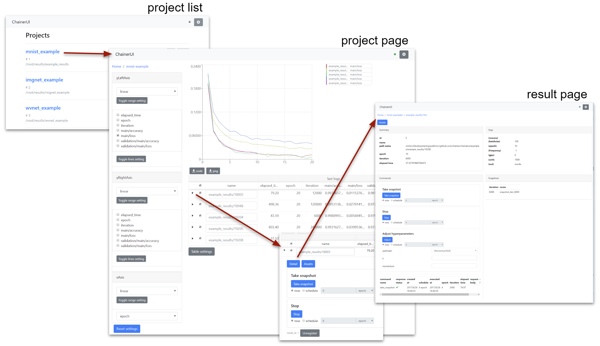

Header
------

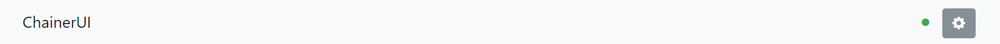

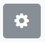

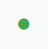

* |header_config| : setup global settings and show ChainerUI version.
  See :ref:`ui_global_settings` section below for more details.
* |header_status_green| : connection status between ChainerUI server
    * green: success to connect
    * blue: loading
    * red: fail to connect
    * gray: disable polling

.. _ui_global_settings:

Global settings
---------------

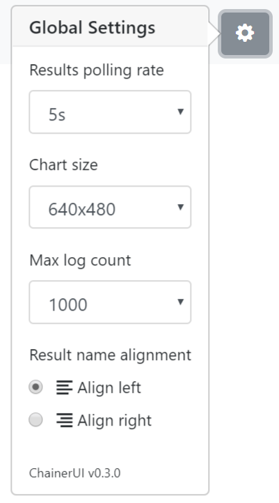

**Results polling rate**

Results polling rate is intervals between updates of results on project pages. When you feel your browser is slow, try choosing a longer value.

**Chart size**

Chart size is the size of the main plot on project pages.

**Max log count**

Max log count is the maximum number of logs per result that the ChainerUI server sends to the browser on each request. When you feel your browser is slow, try choosing a smaller value.

**Result name alignment**

Result name alignment controls which side of a result name to be truncated when it is too long to be displayed.

**Highlight table and chart**

Enable highlighting linked betwheen a table row and a log chart. ``Enabled`` on default.

.. _ui_home_project_list:

Home: Project list
------------------

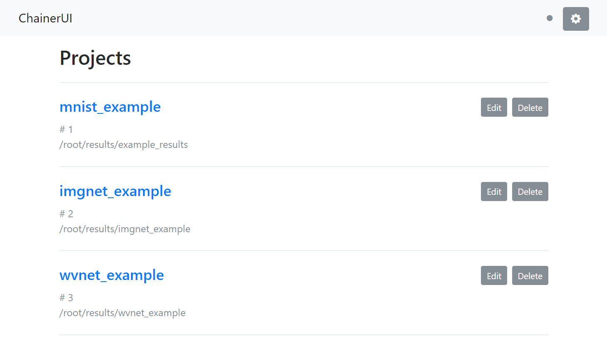

From the list of registered projects, select a project to transition to the project page. When registering a project within running server, refresh the page and it will show the project on the list. See :ref:`getstart_customize_training_loop`.

* ``Desc`` / ``Asc``: select order of project list.
* ``Edit``: edit the project name.
* ``Delete``: delete the project from list.

Project: Show training chart and jobs
-------------------------------------

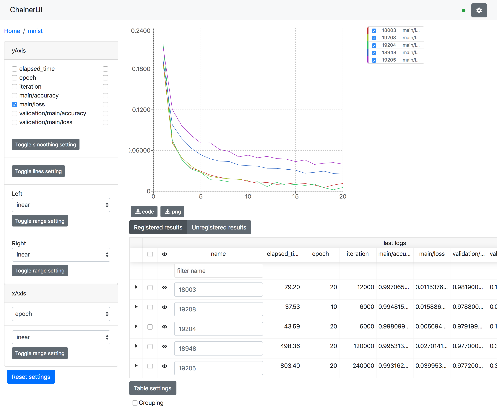

Show training logs and experimental conditions.

* Select X-axis value by ``xAxis`` pane.

    * ``epoch``, ``iteration``, ``episode``, ``step`` and ``elapsed_time`` are assumed as x-axis.
    * Drop-down list shows only keys existed in ``log`` files.

* Select values by ``yAxis`` pane.

    * Left checkboxes are visibility of left axis, right ones are right axis.
    * Line color is selected automatically. To change color, click a job name or a key name, see :ref:`ui_edit_line`.

* Reset setting button

    * Along with axis settings and selected checkboxes, log keys like ``main/loss`` are also cached on browser storage. The reset button restores cached key, too.

* Save log chart

    * ``PNG``: Save log chart as PNG
    * ``Code``: Download Python script. Run the downloaded script then get a chart image using Matplotlib. Lines plotted or not are followed by configuration on Web UI. The script has all log data as JSON.

.. _ui_highlight:

Highlighting
~~~~~~~~~~~~

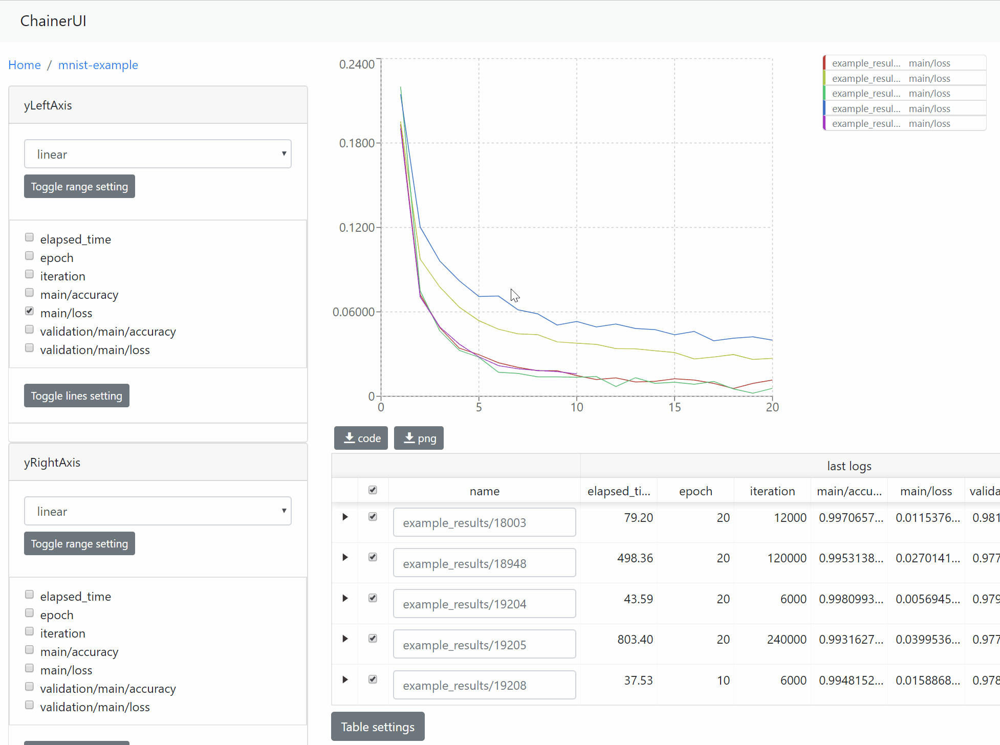

   This animation is captured on **v0.7.0**

Result table and a log chart are linked each other. A selected result is highlighting for emphasis.

.. _ui_save_log_chart:

Smoothing
~~~~~~~~~

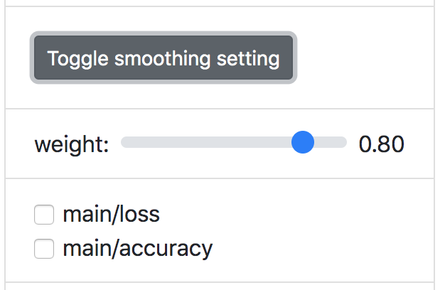

Add smoothing line to help desplaying the overall of trend. Exponential smoothing is used.

.. _ui_edit_line:

Edit a line
~~~~~~~~~~~

.. image:: ../../images/chart_edit_line.png

Show detail information about the line, and enable to change the line color. To show this modal, click ``Toggle lines setting`` >  a job name or a key name on ``yAxis``.

.. _ui_training_job_table:

Training job table
~~~~~~~~~~~~~~~~~~

.. image:: ../../images/result_table.png

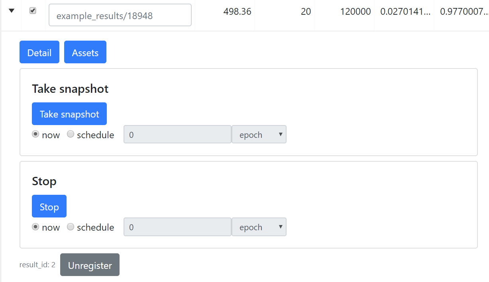

   expanded the second row to show sub components.

The training job table shows brief log information and experimental conditions. Job names are set to the directory name by default. The name can be edit directly on the table. To unregister a result, click ``Unregister`` button in the expanded row. Expanded row has some operation buttons. These buttons operate similarly to buttons in :ref:`Commands pane <ui_result_page_commands>`.

* ``Registered results`` / ``Unregistered results`` : These buttons behavior as tab. When need to show unregistered results, select ``Unregistered result`` tab to show them.
* ``Delete results``: When remove results from the result table, check and click ``Delete result`` button. Deleted resutls are showed on ``Unregistered results`` tab.
* ``Restore results``: When restore deleted result, check the target results on ``Unregistered results`` tab and click ``Restore results`` button. Restored results are showed again on ``Registered results`` tab.

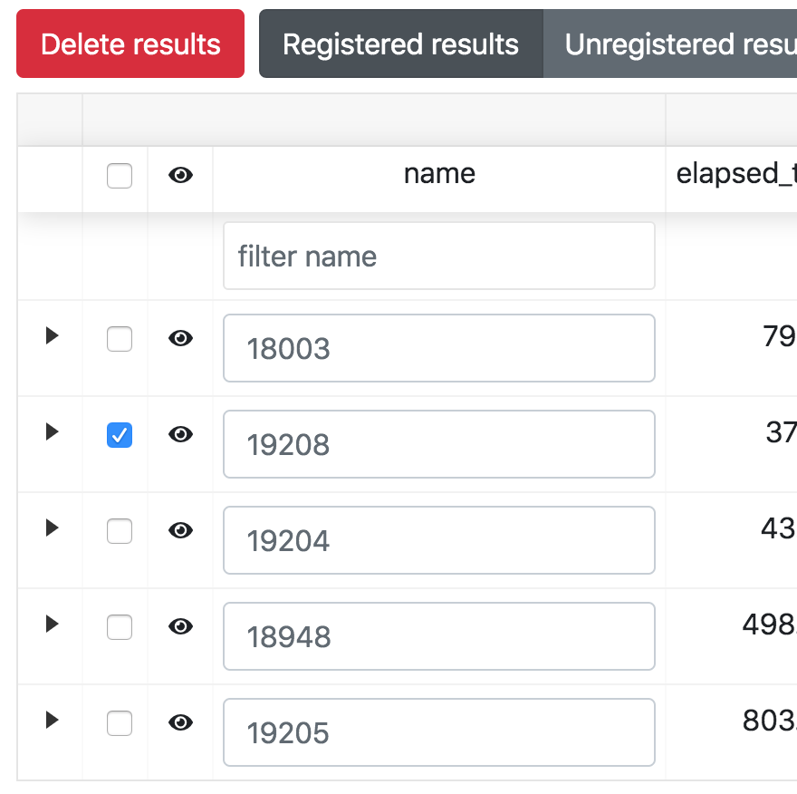
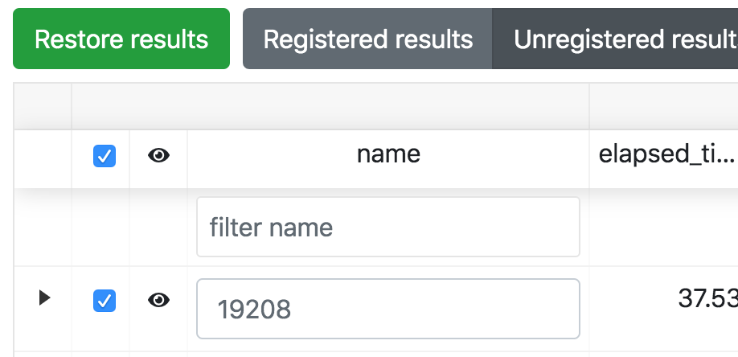

* ``filter name``: Filter results by text.
* ``Grouping``: Group results by grandparent directory.
* ``Table Settings``: Customize visibility and order of table columns.

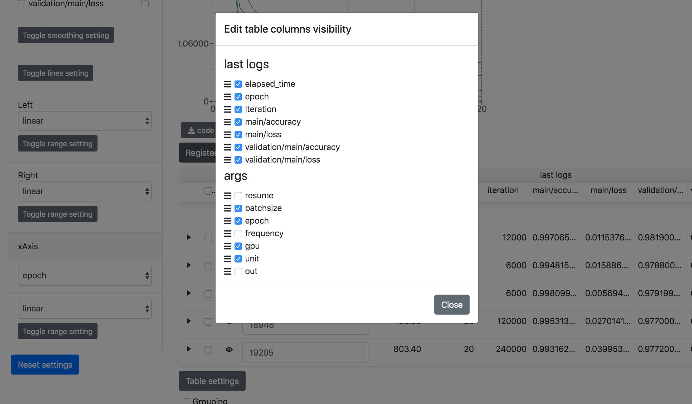

.. _ui_result_page:

Result: Show detailed information of the results
------------------------------------------------

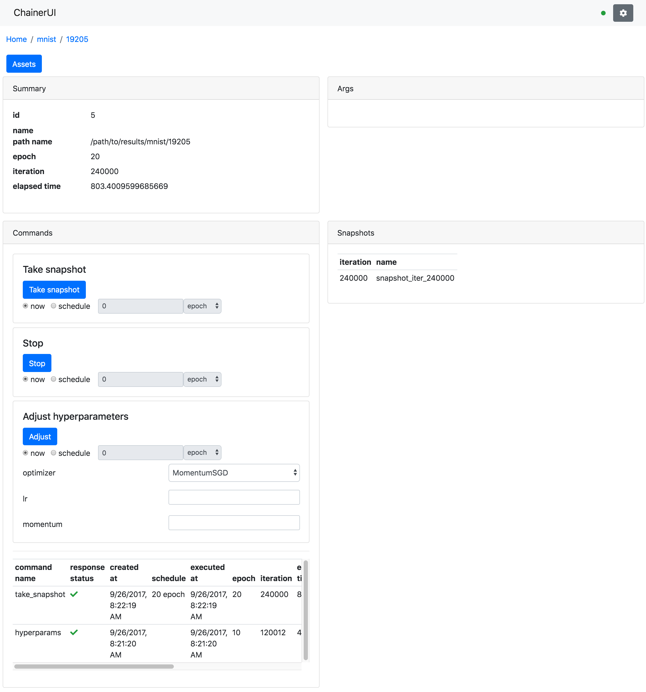

Show detailed information of the training job and support operation of the training loop.

.. _ui_result_page_commands:

Commands pane
~~~~~~~~~~~~~

Operation buttons in ``Commands`` pane allow users to operate the training job. To enable these buttons, the trining job is required to set :ref:`CommandsExtension <module_command_extension>` and click them **within running the job**. For more detail of how to set the extension, see :ref:`getstart_operate_training_loop`.

**Take snapshot**

Save a training model to the file in NPZ format with using `save_napz <https://docs.chainer.org/en/stable/reference/generated/chainer.serializers.save_npz.html>`__ By default, ``snapshot_iter_{.updater.iteration}`` file is saved to the result path.

**Stop**

Stop the trining loop.

**Adjust**

Adjust the hyperparameters of an optimizer. This function supports only `MomentumSGD <https://docs.chainer.org/en/stable/reference/generated/chainer.optimizers.MomentumSGD.html#chainer.optimizers.MomentumSGD>`__ optimizer.

**Command history**

The command history is shown on the down of the pane.
